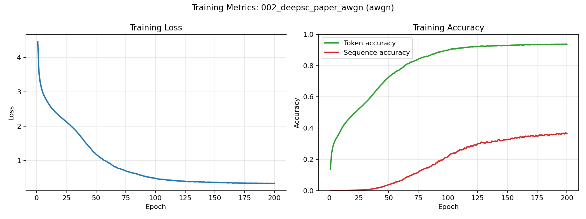
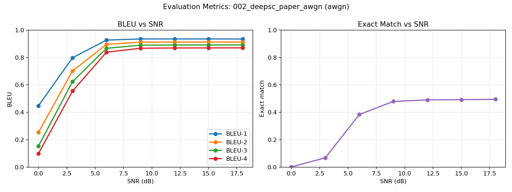

# Experiment 002 — DeepSC AWGN

DeepSC-based text semantic communication over a DeepSC-compatible AWGN channel.

Paper: <https://arxiv.org/abs/2006.10685>

## Config

```text
experiments/002_deepsc_paper_awgn/config.yaml
```

## Dataset

```bash
make prepare-europarl IN=dataset/raw/europarl/
```

`IN` can be any directory containing the dataset's `.txt` files.

The default output directory is:

```text
dataset/processed/europarl/
```

If needed, change it by running the preparation script directly with
`--output-path`:

```bash
python src/semcom/data/prepare_europarl.py \
  --input-dir dataset/raw/europarl/ \
  --output-path path/to/output/
```

If you change the default output directory, update `dataset.text_path` in
`config.yaml` to use the same path.

## Run

```bash
make run-deepsc-text CP=experiments/002_deepsc_paper_awgn/config.yaml
```

## Outputs

```text
results/002_deepsc_paper_awgn/
```

## Plots





## Sample Reconstructions

| Original | SNR (dB) | Reconstructed |
|---|---:|---|
| i approve of the proposed amendments which once again highlight galileo s importance as a strictly civilian project and reject any possibility of using space for military purposes . | 0 | i approve an effective and for our proposal again developed food terms there today which a dramatic provision and discuss particular i does discuss purposes parliaments military purposes . |
|  | 3 | i approve the . proposed amendments which once not highlight galileo s importance as a civilian civilian project have proved any possibility of using space for military fight . |
|  | 6 | i approve of the proposed amendments which once again highlight galileo s importance as a strictly civilian project and reject any immigration of using space for military purposes . |
|  | 9 | i approve of the proposed amendments which once again highlight galileo s importance as a strictly civilian project and reject any possibility of using space for military purposes . |
|  | 12 | i approve of the proposed amendments which once again highlight galileo s importance as a strictly civilian project and reject any possibility of using space for military purposes . |
|  | 15 | i approve of the proposed amendments which once again highlight galileo s importance as a strictly civilian project and reject any possibility of using space for military purposes . |
|  | 18 | i approve of the proposed amendments which once again highlight galileo s importance as a strictly civilian project and reject any possibility of using space for military purposes . |
| president . mr queiro wishes to table an oral amendment in his capacity as rapporteur . | 0 | . . mr increased arrest an opportunity to up amendment in capacity his you . |
|  | 3 | president mr . queiro wishes to table an oral two you it capacity as rapporteur . |
|  | 6 | president . mr queiro wishes to table an oral amendment in his capacity as us . |
|  | 9 | president . mr queiro wishes to table an oral amendment in his capacity as rapporteur . |
|  | 12 | president . mr queiro wishes to table an oral amendment in his capacity as rapporteur . |
|  | 15 | president . mr queiro wishes to table an oral amendment in his capacity as rapporteur . |
|  | 18 | president . mr queiro wishes to table an oral amendment in his capacity as rapporteur . |
