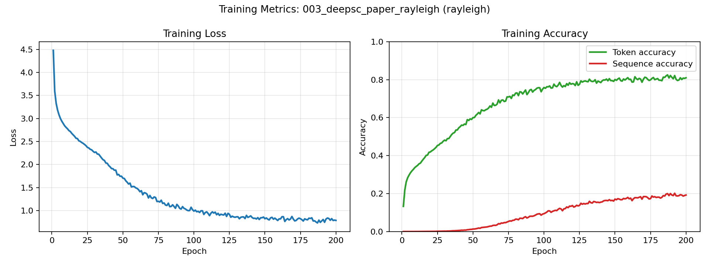
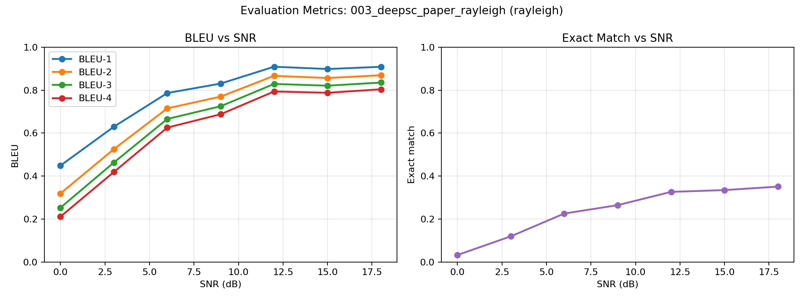

# Experiment 003 — DeepSC Rayleigh

DeepSC-based text semantic communication over a Rayleigh fading channel.

Paper: <https://arxiv.org/abs/2006.10685>

## Config

```text
experiments/003_deepsc_paper_rayleigh/config.yaml
```

## Dataset

```text
dataset/processed/europarl/
```

## Run

```bash
make run-deepsc-text CP=experiments/003_deepsc_paper_rayleigh/config.yaml
```

## Outputs

```text
results/003_deepsc_paper_rayleigh/
```

## Plots





## Sample Reconstructions

| Original | SNR (dB) | Reconstructed |
|---|---:|---|
| i approve of the proposed amendments which once again highlight galileo s importance as a strictly civilian project and reject any possibility of using space for military purposes . | 0 | i therefore believe that proposed by mr president commissioner commissioner s proposal to the council started for project and research on the possibility of gender and community processes . |
|  | 3 | i think of the amendments proposed by commissioner de mr harbour and the climate continuation of civilian economic and its questions within the transport is possible . |
|  | 6 | i would like to conclude mr president commissioner ladies and gentlemen i would like to ask the commission statement on a success of mobile value for military resources . |
|  | 9 | i approve of the following amendments which also just have carried out a global importance of germany improving and any possibility of the using strengthening of enlargement . |
|  | 12 | i approve of the proposed amendments which once again highlight galileo s importance as a strictly civilian project and reject any possibility of using space for military purposes . |
|  | 15 | i approve of the proposed amendments which once again highlight galileo s importance as a strictly civilian project and reject any possibility of using space for military purposes . |
|  | 18 | i approve of the proposed amendments which once again highlight galileo s importance as a strictly civilian project and reject any possibility of using space for military purposes . |
| president . mr queiro wishes to table an oral amendment in his capacity as rapporteur . | 0 | madam president ladies and gentlemen i am voting for amendment in the administrative cooperation . |
|  | 3 | madam president ladies and gentlemen the sitting is acceptable in his subject to be important . |
|  | 6 | madam president i should like to start by the amendments in the following amendments . |
|  | 9 | i will be the conference of table an oral amendment in his contribution as regards . |
|  | 12 | president . mr queiro wishes to table an oral amendment in his capacity as rapporteur . |
|  | 15 | president . mr queiro wishes to table an oral amendment in his capacity as rapporteur . |
|  | 18 | president . mr queiro wishes to table an oral amendment in his capacity as rapporteur . |
