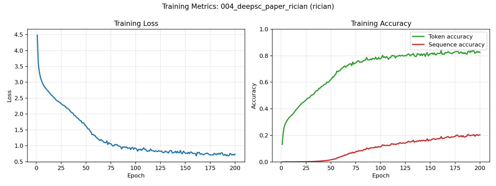
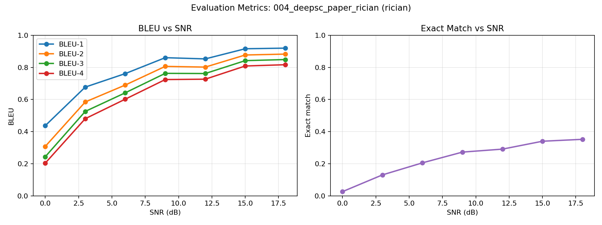

# Experiment 004 — DeepSC Rician

DeepSC-style text semantic communication over a Rician fading channel.

Paper: <https://arxiv.org/abs/2006.10685>

## Config

```text
experiments/004_deepsc_paper_rician/config.yaml
```

## Dataset

```text
dataset/processed/europarl/
```

## Run

```bash
make run-deepsc-text CP=experiments/004_deepsc_paper_rician/config.yaml
```

## Outputs

```text
results/004_deepsc_paper_rician/
```

## Plots





## Sample Reconstructions

| Original | SNR (dB) | Reconstructed |
|---|---:|---|
| i approve of the proposed amendments which once again highlight galileo s importance as a strictly civilian project and reject any possibility of using space for military purposes . | 0 | i hope that the text which are completely acceptable to the european union s political groups and the european people s amendments nos and global of business . |
|  | 3 | i would like to ask the commission s most important and to be taken on the same time to be taken by the european union and the commission . |
|  | 6 | i recommend of the proposed amendments which once again as protests s importance as a person settlement project and reject any possibility of using innovation for military purposes . |
|  | 9 | i approve of the proposed amendments which once again as galileo s importance as a strictly civilian project and reject any possibility of using and for military purposes . |
|  | 12 | i approve of the proposed amendments which once again as galileo s importance as a strictly civilian project and reject any possibility of using space for military purposes . |
|  | 15 | i approve of the proposed amendments which once again as galileo s importance as a strictly regarded project and reject any possibility of using space for military purposes . |
|  | 18 | i approve of the proposed amendments which once again highlight protests s importance as a strictly legally project and reject any possibility of using space for military purposes . |
| president . mr queiro wishes to table an oral amendment in his capacity as rapporteur . | 0 | the next item is the council and the proposal on the european union and regulation ec . |
|  | 3 | the next item is the council and the council and the european parliament s report was not to be taken on the next item . |
|  | 6 | president . mr president wishes to table an oral amendment in his capacity as rapporteur . |
|  | 9 | president . mr president wishes to table an oral amendment in his capacity as rapporteur . |
|  | 12 | president . mr president wishes to table an oral amendment in his capacity as rapporteur . |
|  | 15 | president . mr president wishes to table an oral amendment in his capacity as rapporteur . |
|  | 18 | president . mr president wishes to table an oral amendment in his capacity as rapporteur . |
